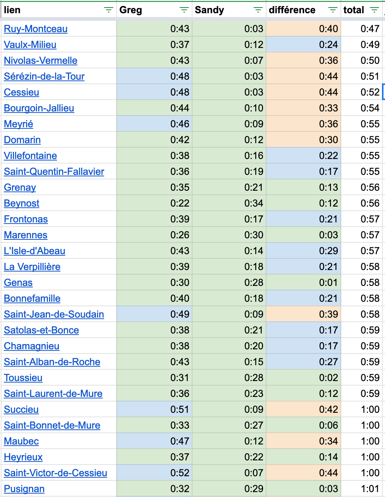
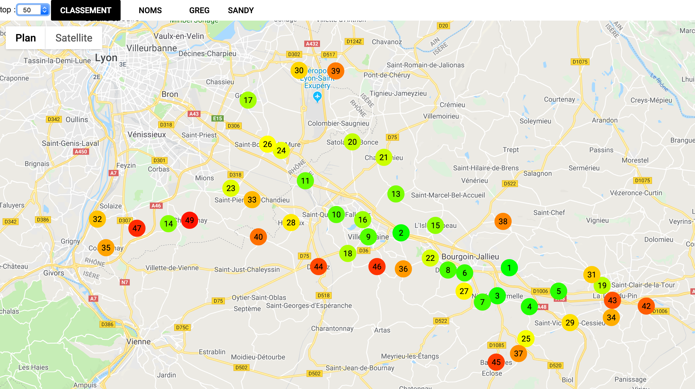
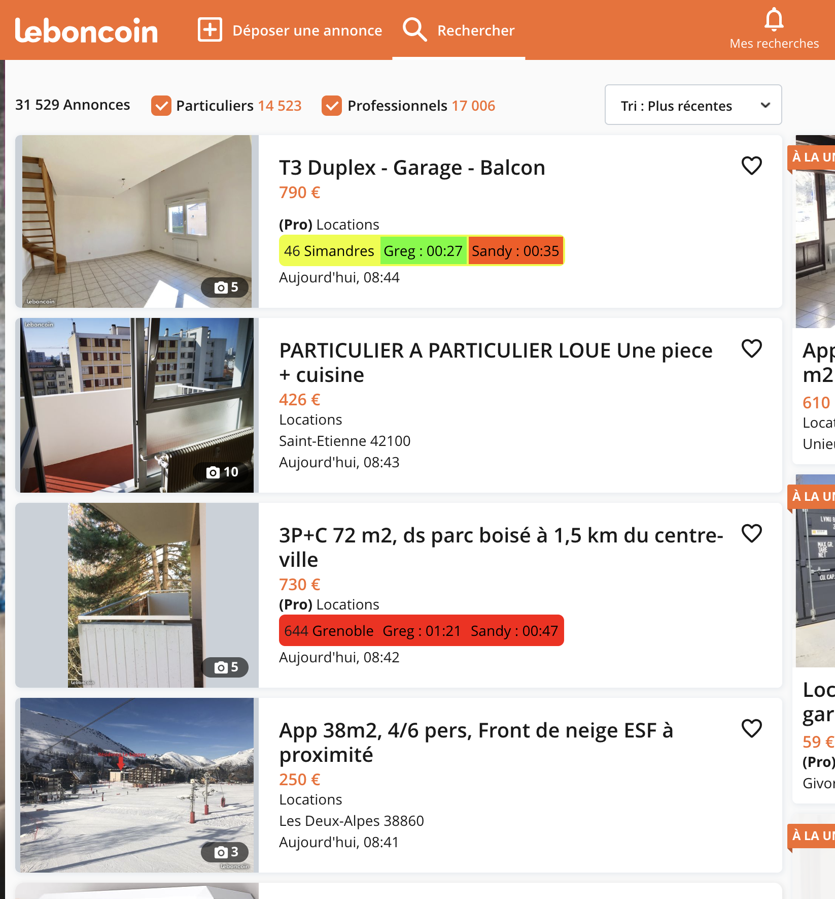

# Home Sweet Home

## Presentation
A set of tools to help you find the perfect spot to live.

## Usage
### Google spreadsheet
The Google spreadsheet will query a list of spots and evaluate if they fit.

Feel free to sort it by any column of your choice.
Some clickable columns will bring you to Google Maps.

### Map
A map of spots with a color code to ease your decision!

Changing the number of spots to display will update the coloring

You can switch view between:
- position of each spot on the podium
- names of the spots
- position of each spot regarding each destination

A click 

### Le bon coin
- a plugin for www.leboncoin.fr

1. Visit www.leboncoin.fr or other variant, search for real estate
1. Enjoy

# Installation

## Pre-requisites
`TODO define procedure to generate a Google developer key`
1. Copy `config.example.ts` to `config.ts` and update it:
1. Define your destinations (only two destinations supported at the moment)
    1. Address in `location`
    1. Name the person in `for`
    1. *Percentage of the commute time* that you would like to affect to this travel in `percent`
1. Set the maximum number of spots to consider in `limit`

## Google SpreadSheet
1. Copy list of cities from Wikipedia to the spreadsheet
    - visit Wikipedia. Example https://fr.wikipedia.org/wiki/Liste_des_communes_du_Rh%C3%B4ne
    - Copy the table. Plugins exist to help: https://chrome.google.com/webstore/detail/table-capture/iebpjdmgckacbodjpijphcplhebcmeop
    - Make sure "postal code" is the third column
    - Paste it in spreadsheet at column A
1. Generate script
    `npm run build:spreadsheet`
1. Copy the generated `build/home_sweet_home.js` content to script editor
1. In Google Spreadsheet, run `step2_updateFromGPSLocations`
1. Run `step3_updateToFromDurations`
### Export of cities
1. Copy `cities.example.ts` to `cities.ts`
1. Copy content of column U to the file
1. [TODO should not be needed] Delete "absurd" cities at the end of the list (mislocated by Google)

## Map

## Le Bon Coin
1. Install GreaseMonkey extension on Firefox or TamperMonkey extension on Chrome.
1. Generate script for Le Bon Coin
    `npm run build:leboncoin`
1. Copy generated `build/leboncoin.js` content to a new script on the browser extension
1. Visit the site and enjoy